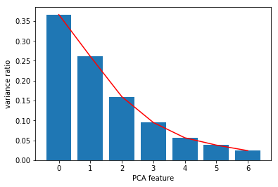
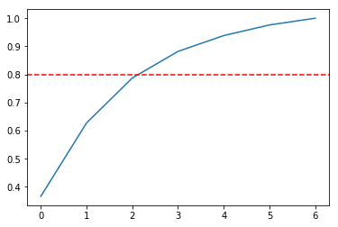
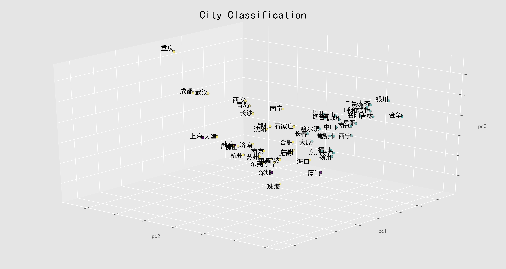

## 1. Preparing dataset


```python
import pandas as pd
import numpy as np
import matplotlib.pyplot as plt
from sklearn.decomposition import PCA
```


```python
cc = pd.read_excel('classify.xlsx', index_col = 'city', sheet_name = 'first')
print(cc.head())
```

          三年新房平均成交面积（万平米）  三年新房平均成交均价（元/平米）  常住人口数量（万人）  一二手房成交面积比  \
    city                                                             
    北京         739.566667      35075.000000     2173.00   0.369459   
    上海        1167.993333      39507.000000     2419.70   0.376709   
    广州        1159.996667      16059.333333     1404.35   1.102241   
    深圳         447.702797      47108.333333     1190.84   0.531566   
    重庆        2093.116667       7604.333333     3048.00   4.117607   
    
          人均新房累计销售面积平均增长率   top15市占  政策打分  
    city                                   
    北京           0.027843  0.257012  20.5  
    上海           0.036613  0.240077  21.5  
    广州           0.076433  0.327630  20.0  
    深圳           0.053448  0.229867  19.0  
    重庆           0.084390  0.288721   5.0  


## 2. Normalizing the feature data & PCA on scaled data


```python
from sklearn.preprocessing import StandardScaler

scaler = StandardScaler()
cc_scaled = scaler.fit_transform(cc)

pca = PCA()
pca.fit(cc_scaled)

# Plot the explained variances
features = range(pca.n_components_)
exp_variance = pca.explained_variance_ratio_

plt.bar(features, exp_variance)
plt.plot(features, exp_variance, c = 'red')
plt.xlabel('PCA feature')
plt.ylabel('variance ratio')
plt.xticks(features)
plt.show()
```





## 3. Further visualization of PCA
There's no clear 'elbow' showed in the plot above, which means it is not straightforward to find the number of intrinsic dimensions using this method.
Instead, I look at the cumulative explained variance plot to determine how many features are required to explain 80% of the variance. 


```python
# Calculate the cumulative explained variance
cum_exp_variance = np.cumsum(exp_variance)

# Plot the cumulative explained variance and draw a dashed line at 0.80.
fig, ax = plt.subplots()
ax.plot(cum_exp_variance)
ax.axhline(y=0.8, linestyle='--', c = 'red')
plt.show()
```





## 4. PCA
3 components can already explain 80% of the variance.


```python
n_components = 3

# Perform PCA with the chosen number of components and project data onto components
pca = PCA(n_components, random_state= 10)
pca.fit(cc_scaled)
pca_features = pca.transform(cc_scaled)
print(pca_features.shape)
```

    (54, 3)


## 5. K-Means Clustering


```python
%matplotlib inline
from sklearn.cluster import KMeans
import seaborn as sns

model = KMeans(n_clusters = 3)
model.fit(pca_features)
print(model.inertia_)

```

    143.90434102440634


## 6. Visualize the model


```python

plt.style.use('ggplot')

plt.rcParams['font.sans-serif']=['SimHei'] #用来正常显示中文标签

pc1 = pca_features[:, 0]
pc2 = pca_features[:, 1]
pc3 = pca_features[:, 2]
labels = model.labels_

from mpl_toolkits.mplot3d import Axes3D

fig = plt.figure(figsize = (15, 8))
ax = Axes3D(fig, elev= 25, azim= 130)

ax.scatter(pc2, pc1, pc3,
           c = labels, edgecolor = 'k', s = 30, label = labels)

# plot each point's index as text above
for i in range(len(pc1)): 
    ax.text(pc2[i], pc1[i], pc3[i]*1.05, '%s'%(cc.index[i]), ha = 'right', va = 'center', fontsize=14, color='k')
    

    
ax.w_xaxis.set_ticklabels([])
ax.w_yaxis.set_ticklabels([])
ax.w_zaxis.set_ticklabels([])
ax.set_xlabel('pc2')
ax.set_ylabel('pc1')
ax.set_zlabel('pc3')
ax.set_title('City Classification', size = 24)
ax.dist = 10

plt.show()
fig.savefig('classify.png', dpi = 300)
```





```python
dict = {}

for i in range(54):
    if labels[i] == 1:
        dict[cc.index[i]] = '三线城市'
    elif labels[i] == 2:
        dict[cc.index[i]] = '一线城市'
    else:
        dict[cc.index[i]] = '二线城市'
        
```


```python
print(dict)
```

    {'北京': '一线城市', '上海': '一线城市', '广州': '二线城市', '深圳': '一线城市', '重庆': '二线城市', '成都': '二线城市', '天津': '二线城市', '杭州': '二线城市', '苏州': '二线城市', '武汉': '二线城市', '南京': '二线城市', '福州': '三线城市', '西安': '二线城市', '长沙': '二线城市', '合肥': '二线城市', '大连': '三线城市', '厦门': '一线城市', '佛山': '二线城市', '宁波': '二线城市', '东莞': '二线城市', '无锡': '二线城市', '南昌': '二线城市', '济南': '二线城市', '长春': '三线城市', '中山': '三线城市', '昆明': '三线城市', '温州': '三线城市', '惠州': '二线城市', '泉州': '三线城市', '贵阳': '三线城市', '常州': '三线城市', '唐山': '三线城市', '扬州': '三线城市', '南宁': '二线城市', '石家庄': '二线城市', '洛阳': '三线城市', '海口': '二线城市', '襄阳': '三线城市', '沈阳': '二线城市', '郑州': '二线城市', '哈尔滨': '三线城市', '烟台': '三线城市', '银川': '三线城市', '乌鲁木齐': '三线城市', '呼和浩特': '三线城市', '太原': '三线城市', '西宁': '三线城市', '吉林': '三线城市', '兰州': '二线城市', '岳阳': '三线城市', '青岛': '二线城市', '珠海': '二线城市', '南通': '三线城市', '金华': '三线城市'}


```python
dict['北京']
```


    '一线城市'
